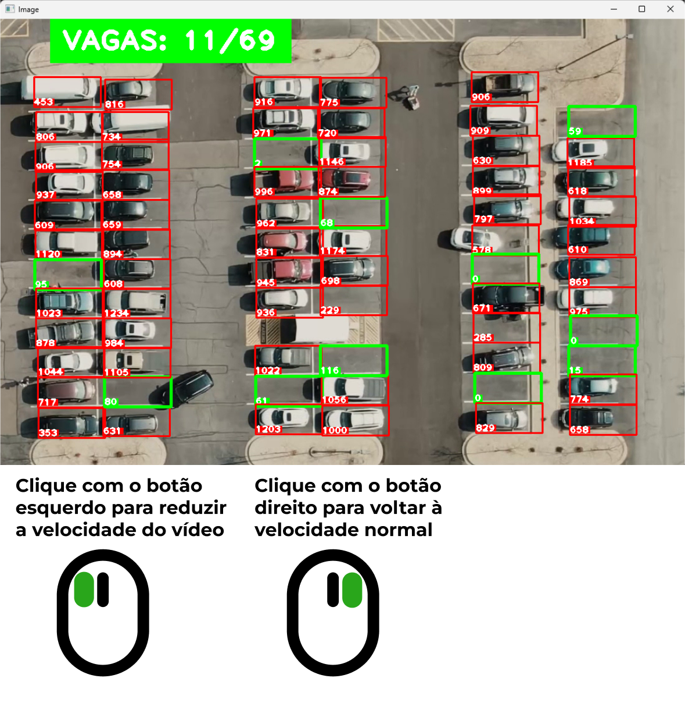

# Projeto de visão computacional utilizando a biblioteca OpenCV

### Executando o primeiro script

O primeiro script serve para marcar os locais onde serão feitas as transformações para  checar se há ou não carro na vaga, onde será feito um trabalho de marcação manual utilizando o botão esquerdo do mouse para marcar a região desejada, e o botão direito do mouse, caso  a marcação estiver errada.

